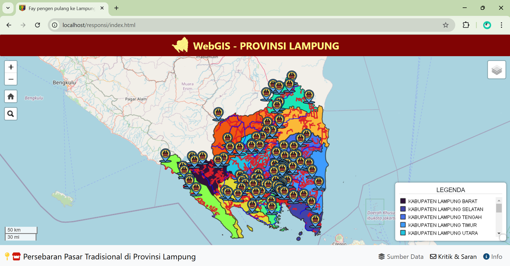
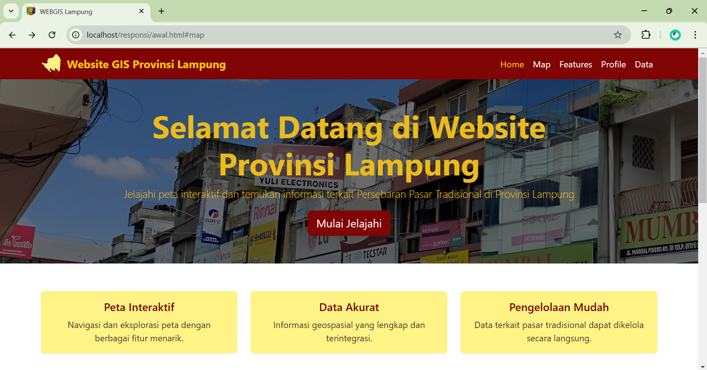
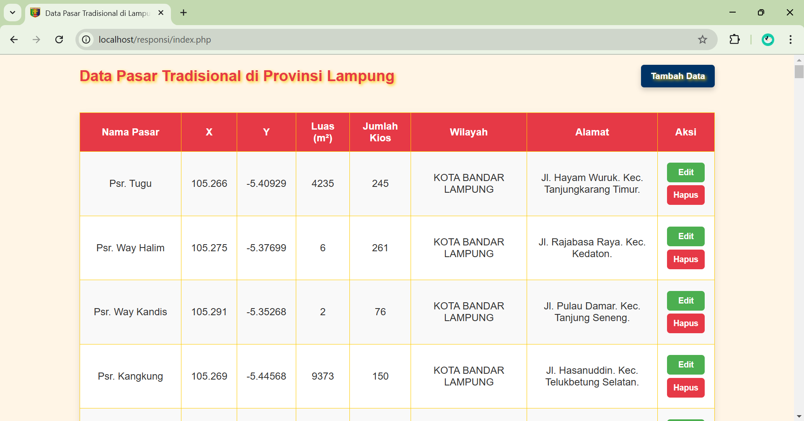
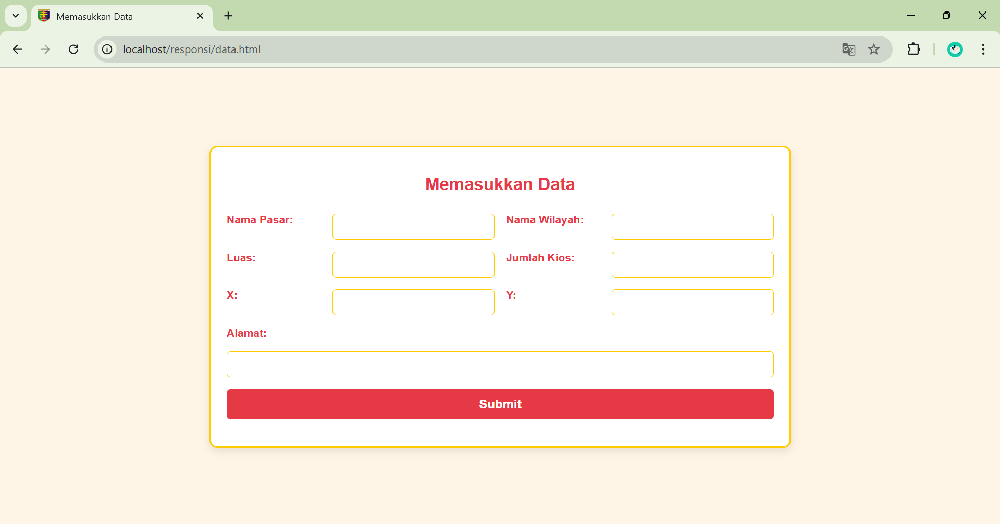

# WEBGIS Persebaran Pasar Tradisional di Provinsi Lampung
Website ini dibuat untuk mempermudah masyarakat dalam mengakses informasi terkait lokasi dan data pasar tradisional di Provinsi Lampung. Platform ini juga mendukung pemerintah dalam proses perencanaan dan pengelolaan pasar melalui penyajian data yang terstruktur dan berbasis digital. Website ini juga berfungsi sebagai sarana promosi untuk meningkatkan daya tarik pasar tradisional, baik bagi masyarakat lokal maupun wisatawan. Sistem ini memberikan efisiensi operasional dengan memungkinkan pemantauan dan pembaruan data secara mudah dan cepat.
>**Tujuan Pembuatan Website**
>
> Website diciptakan agar, meningkatkan akses informasi untuk masyarakat dan pengelola pasar di Provinsi Lampung, serta mendukung perencanaan daerah berbasis data spasial.

>**Komponen Pembangun**
>
>Website ini menggunakan data yang didapatkan dari geoportal Lampung dan GeoServer, serta menggunakan PHP dalam pengambilan data yang berada pada database phpmyAdmin. Selain itu, penggunaan library JavaScript berupa Leaflet.JS dalam menampilkan basemap hingga plugins yang ada pada website tersebut. Pengambilan style yang lebih menarik didapatkan dari BootStrap dan FontAwesome digunakan dalam pengambilan icon yang menarik pada file HTML dan PHP.

>**Sumber Data**
>
>Geoportal Provinsi Lampung
[https://palapa.lampungprov.go.id/](https://palapa.lampungprov.go.id/)

>**Tangkapan Layar Komponen Penting pada Website**
>
>
>
>

“Membawa Informasi Pasar Tradisional di Provinsi Lampung ke Era Digital!”

